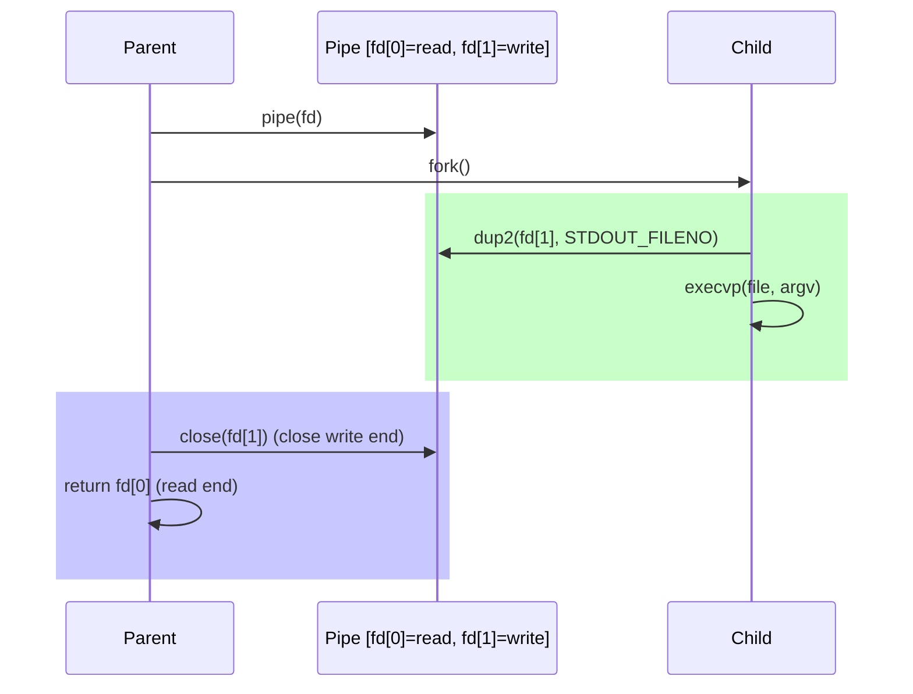

# Pipe flow in ft_popen

## Case: type == 'r' (Parent reads from Child)

```mermaid
sequenceDiagram
    participant Parent
    participant Pipe as Pipe [fd[0]=read, fd[1]=write]
    participant Child

    Parent->>Pipe: pipe(fd)
    Parent->>Child: fork()

    rect rgb(200, 255, 200)
        Child->>Pipe: dup2(fd[1], STDOUT_FILENO)
        Child->>Child: execvp(file, argv)
    end

    rect rgb(200, 200, 255)
        Parent->>Pipe: close(fd[1]) (close write end)
        Parent->>Parent: return fd[0] (read end)
    end
``` 