# **flujo de ejecución** del `picoshell` con **pipes + fork + execvp**.

Aquí te paso un diagrama que refleja tu código (`echo hola | grep l | sed s/l/HH/`):

```mermaid
sequenceDiagram
    participant Parent as Parent (picoshell)
    participant Pipe1 as Pipe1 [fd[0], fd[1]]
    participant Pipe2 as Pipe2 [fd[0], fd[1]]
    participant Child1 as Child 1 (echo hola)
    participant Child2 as Child 2 (grep l)
    participant Child3 as Child 3 (sed s/l/HH)

    Note over Parent: Loop i = 0 → cmd1 = echo

    Parent->>Pipe1: pipe(fd)
    Parent->>Child1: fork()
    alt Child process
        Child1->>Pipe1: dup2(fd[1], STDOUT)
        Child1->>Pipe1: close(fd[0], fd[1])
        Child1->>Child1: execvp("echo", {"echo","hola"})
    else Parent process
        Parent->>Pipe1: close(fd[1])
        Parent->>Parent: prev_pipe = fd[0]
    end

    Note over Parent: Loop i = 1 → cmd2 = grep

    Parent->>Pipe2: pipe(fd)
    Parent->>Child2: fork()
    alt Child process
        Child2->>Pipe1: dup2(prev_pipe, STDIN)
        Child2->>Pipe2: dup2(fd[1], STDOUT)
        Child2->>Pipe1: close(prev_pipe)
        Child2->>Pipe2: close(fd[0], fd[1])
        Child2->>Child2: execvp("grep", {"grep","l"})
    else Parent process
        Parent->>Pipe2: close(fd[1])
        Parent->>Pipe1: close(prev_pipe)
        Parent->>Parent: prev_pipe = fd[0]
    end

    Note over Parent: Loop i = 2 → cmd3 = sed

    Parent->>Pipe1: pipe(fd)
    Parent->>Child3: fork()
    alt Child process
        Child3->>Pipe2: dup2(prev_pipe, STDIN)
        Child3->>Pipe1: close(prev_pipe)
        Child3->>Pipe1: close(fd[0], fd[1])
        Child3->>Child3: execvp("sed", {"sed","s/l/HH/"})
    else Parent process
        Parent->>Pipe1: close(fd[1])
        Parent->>Pipe2: close(prev_pipe)
        Parent->>Pipe1: close(fd[0])  <!-- last command, no next pipe -->
    end

    Note over Parent,Child3: Parent waits for all children
    Parent->>Parent: wait(NULL) x3
```


```

#📌 **Qué muestra este flujo:**

1. El `Parent` crea un `pipe` y hace `fork()`.
2. En el hijo redirige `stdin/stdout` con `dup2()` y ejecuta el comando con `execvp()`.
3. El padre va cerrando los `fd` que no necesita y actualiza `prev_pipe`.
4. Al final, el padre espera (`wait`) a que terminen todos los hijos.

---
