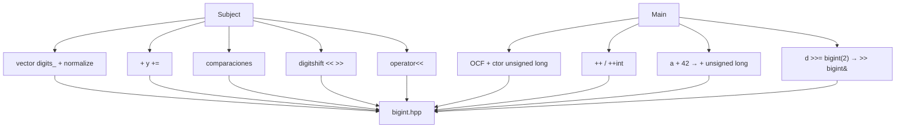

# bigint — cómo identificar qué va en `bigint.hpp`

Referencia: `../subject.txt` + main del subject.

---

## Método en 3 pasos (examen)

### 1. Lee el subject → lista explícita

| Frase del subject | Qué va en `.hpp` |
|-------------------|------------------|
| "arbitrary precision **unsigned** integer" | `vector<unsigned char> digits_` (dígitos 0–9) |
| "**addition**" | `operator+`, `operator+=` |
| "**comparison**" | `==`, `!=`, `<`, `>`, `<=`, `>=` |
| "**digitshift**" (base 10, no bits) | `<<`, `<<=`, `>>`, `>>=` |
| `42 << 3 == 42000` | `<<` multiplica por 10^n (añade ceros) |
| `1337 >> 2 == 13` | `>>` divide por 10^n (quita dígitos) |
| "printable with **<<**" | `friend operator<<` |
| "no **leading zeros**" | método privado `normalize()` |
| almacenar en array/string | `from_ulong()` privado |

### 2. Recorre el main línea a línea

| Línea del main | Declaración necesaria |
|----------------|----------------------|
| `const bigint a(42)` | `bigint(unsigned long n)` |
| `bigint b(21), c, d(1337), e(d)` | default ctor, copy ctor |
| `a + b` | `operator+(const bigint&) const` |
| `(c += a)` | `operator+=(const bigint&)` |
| `++b`, `b++` | `operator++()`, `operator++(int)` |
| `(b << 10) + 42` | `<<`, `+ bigint`, **`+ unsigned long`** |
| `(d <<= 4)` | `operator<<=(unsigned long)` |
| `(d >>= (const bigint)2)` | **`operator>>=(const bigint&)`** ← no int |
| `d < a`, `<=`, `>`, `>=`, `==`, `!=` | 6 operadores de comparación |

### 3. OCF (Rule of 3 — rank05)

```cpp
bigint();
bigint(unsigned long n);
bigint(const bigint& other);
bigint& operator=(const bigint& other);
~bigint();   // puede estar vacío si solo vector
```

---

## Checklist completo `bigint.hpp`

```cpp
class bigint {
    std::vector<unsigned char> digits_;
    void from_ulong(unsigned long n);  // privado
    void normalize();                  // privado

public:
    // OCF
    bigint();
    bigint(unsigned long n);
    bigint(const bigint& other);
    bigint& operator=(const bigint& other);
    ~bigint();

    // Salida
    friend std::ostream& operator<<(std::ostream& os, const bigint& b);

    // Comparación — solo implementa == y < en .cpp; el resto delega
    bool operator==(const bigint& other) const;
    bool operator!=(const bigint& other) const;
    bool operator<(const bigint& other) const;
    bool operator>(const bigint& other) const;
    bool operator<=(const bigint& other) const;
    bool operator>=(const bigint& other) const;

    // Suma — implementa + ; el resto delega
    bigint operator+(const bigint& other) const;
    bigint operator+(unsigned long n) const;
    bigint& operator+=(const bigint& other);
    bigint& operator+=(unsigned long n);
    bigint& operator++();
    bigint operator++(int);

    // Digit shift (NO es bitshift)
    bigint operator<<(unsigned long n) const;
    bigint& operator<<=(unsigned long n);
    bigint operator>>(const bigint& other) const;   // ← bigint, no int
    bigint& operator>>=(const bigint& other);
};
```

---

## Traducir expresión → operador

```text
a + b       → operator+(const bigint&) const
a += b      → operator+=
++a / a++   → operator++ / operator++(int)
a << 3      → operator<<(unsigned long)   ← digit shift ×10³
a <<= 4     → operator<<=
a >> b      → operator>>(const bigint&)   ← ojo: b es bigint
a >>= b     → operator>>=
a + 42      → operator+(unsigned long)   ← imprescindible
a == b      → operator==
a < b       → operator<
cout << a   → friend operator<<
```

---

## Mapa: subject + main → `.hpp`



---

## Qué implementar vs delegar (versión compacta)

```text
IMPLEMENTA (lógica real):
  from_ulong, normalize
  operator<<
  operator== , operator<
  operator+ (bigint + bigint)
  operator<< (digit shift izquierda)
  operator>> (digit shift derecha)

DELEGA (1 línea):
  !=  → !(*this == other)
  >   → other < *this
  <=  → !(*this > other)
  >=  → !(*this < other)
  + unsigned long → *this + bigint(n)
  +=  → *this = *this + other
  ++  → *this += 1
  ++(int) → copia + ++(*this)
  <<= → *this = *this << n
  >>= → *this = *this >> other
```

---

## Trampas específicas de bigint

| Trampa | Solución |
|--------|----------|
| `<<` parece bitshift | Es **×10^n** en base 10 |
| `>>` con int en main | Main hace `(const bigint)2` → parámetro **`const bigint&`** |
| `(b << 10) + 42` | Necesitas `operator+(unsigned long)` |
| `bigint res;` en `+` | Hacer `res.digits_.clear()` (ctor deja `[0]`) |
| Dígitos al revés | 1337 → `[7,3,3,1]`; imprimir de atrás hacia adelante |
| Ceros a la izquierda | `normalize()` tras `+` y `>>` |
| `const bigint a(42)` | Métodos de lectura llevan `const` |

---

## Orden en el examen

```text
1. struct + OCF + from_ulong + normalize
2. operator<<  → probar: bigint(42) imprime 42
3. operator== y operator<
4. operator+ y delegar +=, ++, + unsigned long
5. operator<< y >>= (digit shift)
6. delegar != > <= >=, <<=, >>, ++(int)
```

---

## Compilar

```bash
cd exam_rank05/level-01/biginit/bigint-compact
c++ -Wall -Wextra -std=c++98 bigint.cpp main.cpp -o bigint
./bigint
```
