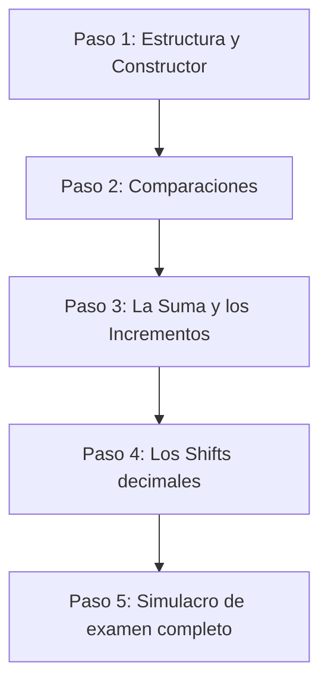

Para dominar este ejercicio de la forma más eficiente y sin agobios, te recomiendo seguir un **plan de desarrollo incremental (paso a paso)**. En lugar de intentar escribir todo el código de golpe (lo cual suele frustrar y generar decenas de errores de compilación), es mucho mejor ir de menos a más, compilando y probando en cada paso.

Aquí tienes la hoja de ruta que te recomiendo para empezar hoy mismo:

---

### 🚀 Plan de Aprendizaje Paso a Paso

---

#### 📋 Paso 1: La estructura básica y la impresión (El Esqueleto)
El objetivo de este paso es definir la clase, poder crear números grandes y poder imprimirlos por pantalla.

1. **Crea la clase `bigint`** con un único miembro privado: `std::vector<unsigned char> digits_;`.
2. **Implementa el constructor por defecto**: Debe inicializar el vector con un único elemento `0`.
3. **Implementa el constructor desde número**: Un constructor `bigint(unsigned long n)` que descomponga el número en dígitos usando divisiones y módulos por 10 (`n % 10` y `n /= 10`) y los guarde en el vector.
    * *Recuerda*: Si entra `1337`, tu vector debe quedar como `[7, 3, 3, 1]`.
4. **Implementa el operador de salida `<<`**: Que recorra el vector de atrás hacia adelante (del dígito más significativo al menos) y los imprima.
5. **Prueba esto**: Escribe un `main` muy simple que haga `bigint a(42); std::cout << a << std::endl;` y comprueba que se imprima `42` correctamente.

---

#### 📋 Paso 2: Comparaciones (Los puntos fáciles del examen)
Las comparaciones en BigInt son sumamente lógicas e intuitivas cuando se usa un vector.

1. **Implementa `operator==`**: Es tan sencillo como `return digits_ == other.digits_;` (C++ ya compara los vectores elemento por elemento).
2. **Implementa `operator<`**:
    * Si tienen diferente tamaño (`size()`), el de menor tamaño es más pequeño.
    * Si tienen el mismo tamaño, recorre el vector desde el final (dígito más significativo) hacia el principio. El primero que difiera determina cuál es menor.
3. **Implementa los demás operadores (`!=`, `>`, `<=`, `>=`)** delegando en `==` y `<`. Por ejemplo:
    * `operator!=` es `!(*this == other)`
    * `operator>` es `other < *this`

---

#### 📋 Paso 3: El motor matemático (Suma e Incrementos)
Aquí es donde el enfoque del vector en orden inverso demuestra su superioridad.

1. **Implementa `operator+`**:
    * Averigua el tamaño máximo entre ambos bigints usando `std::max`.
    * Haz un bucle desde `0` hasta el tamaño máximo (o mientras quede acarreo).
    * Suma los dígitos de esa posición si existen, añade el acarreo (*carry*), saca el módulo por 10 para el nuevo dígito y divide por 10 para calcular el nuevo acarreo.
2. **Implementa `operator+=`**: Delegando en el operador `+`.
3. **Implementa el pre-incremento (`++a`) y post-incremento (`a++`)**. El post-incremento guarda una copia temporal, llama al pre-incremento y devuelve la copia.

---

#### 📋 Paso 4: Los Shifts decimales (La parte final)
Los desplazamientos de dígitos (multiplicar y dividir por potencias de 10).

1. **Entiende la normalización (`normalize()`)**: Un método privado que elimine los ceros redundantes a la derecha del vector (que serían ceros a la izquierda en el número real), cuidando de no borrar el último `0` si el número es exactamente cero.
2. **Implementa `operator<<`**: Insertar `n` ceros al principio del vector (`insert` en `begin()`).
3. **Implementa `operator>>`**:
    * Primero, convierte el bigint que recibes como parámetro a un tipo entero estándar (`unsigned long`).
    * Elimina esos primeros dígitos del principio del vector (`erase` desde `begin()`).
    * Llama a `normalize()`.

---

### 🛠️ ¿Cómo empezamos ahora mismo?

Te sugiero que **hagamos el Paso 1 juntos** en una carpeta limpia de prácticas. Podemos usar la carpeta `pract003` (que estaba a medias y vacía) para empezar desde cero, o crear una nueva llamada `pract03`.

Si te parece bien, dime **"Empecemos el Paso 1 en pract03"** y crearé los archivos `bigint.hpp`, `bigint.cpp` y un `main.cpp` limpio de pruebas para que podamos compilar y ver cómo funciona el esqueleto básico en tiempo real. ¿Te hace?