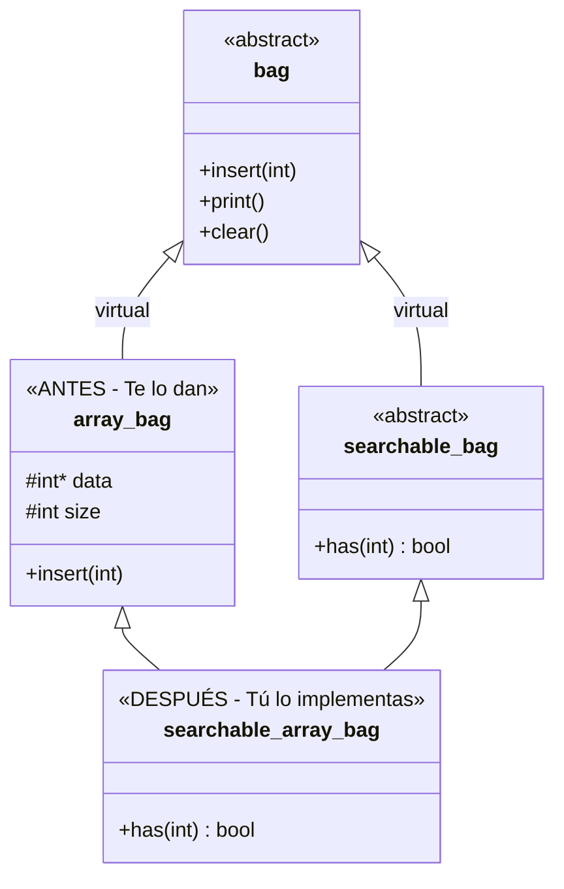

# Desglose de Implementación: Array y Tree

Este documento se enfoca exclusivamente en entender cómo están estructurados los componentes `array` y `tree` **antes** y **después** de tu implementación, de acuerdo a las especificaciones del examen (`subject.txt`).

---

## 1. El escenario base (Lo que te dan)

Antes de escribir tu código, el sistema se compone de clases base e implementaciones concretas que **no tienen capacidad de búsqueda**.

### Las Interfaces
- `bag`: Es la interfaz más básica. Define qué se puede hacer (insertar elementos, imprimir y limpiar), pero no cómo.
- `searchable_bag`: Hereda de `bag` (de forma virtual) y añade un solo método: `virtual bool has(int) const = 0`.

### Las Implementaciones Incompletas
1. **`array_bag`**:
   - Hereda virtualmente de `bag`.
   - Tiene internamente un arreglo dinámico (`int *data`) y su tamaño (`int size`), definidos como `protected`.
   - Permite añadir elementos pero **no permite buscar** si un elemento ya existe.
2. **`tree_bag`**:
   - Hereda virtualmente de `bag`.
   - Tiene internamente una estructura de árbol binario (`node *tree`), definido como `protected`.
   - Permite añadir elementos pero **no permite buscar**.

> [!IMPORTANT]
> Tanto `data` en `array_bag` como `tree` en `tree_bag` son `protected`. Esto significa que las clases que hereden de ellas podrán acceder directamente a estas variables sin necesidad de getters.

---

## 2. Lo que debes implementar (El "Después")

El objetivo de la Primera Parte del *subject* es dotar a estos "bags" (bolsas) de la capacidad de búsqueda. Para ello, vas a crear dos nuevas clases.

### Paso 1: `searchable_array_bag`

Debes crear una clase que una la lógica de almacenamiento del array con la interfaz de búsqueda.

**¿De quién hereda?**
Hereda de `array_bag` (para obtener la lógica de almacenamiento y las variables `data` y `size`) y de `searchable_bag` (para heredar la obligación de implementar `has(int)`).

```cpp
class searchable_array_bag : public array_bag, public searchable_bag {
    // ...
};
```

**¿Qué debes implementar?**
Solo necesitas implementar el método `has(int) const`.
Como heredas de `array_bag`, tienes acceso directo a `this->data` y `this->size`.
La implementación es simplemente un bucle `for` que recorre `data` desde `0` hasta `size - 1` buscando el entero. Si lo encuentra devuelve `true`, de lo contrario `false`.

**Cuidado Especial (Forma Canónica Ortodoxa):**
Debido al "Problema del Diamante" resuelto con herencia virtual (`virtual public bag`), el constructor de la clase hija final (`searchable_array_bag`) es el responsable de inicializar la clase base virtual compartida (`bag`). No lo olvides en tu constructor por defecto, de copia y operador de asignación.

#### Diagrama de Clases: Evolución de Array



### Paso 2: `searchable_tree_bag`

Similar al array, debes unir la lógica del árbol con la capacidad de búsqueda.

**¿De quién hereda?**
Hereda de `tree_bag` y de `searchable_bag`.

```cpp
class searchable_tree_bag : public tree_bag, public searchable_bag {
    // ...
};
```

**¿Qué debes implementar?**
Implementas el método `has(int) const`.
Como heredas de `tree_bag`, tienes acceso a `this->tree` (el puntero a la raíz del árbol).
La implementación consiste en recorrer el árbol binario para encontrar el valor. Si el valor buscado es menor que el nodo actual, vas a la izquierda (`node->l`); si es mayor, vas a la derecha (`node->r`); si es igual, devuelves `true`.

---

## Resumen de la Evolución

| Característica | `array_bag` (Antes) | `searchable_array_bag` (Después) | `tree_bag` (Antes) | `searchable_tree_bag` (Después) |
| :--- | :--- | :--- | :--- | :--- |
| **Almacenamiento** | Arreglo dinámico (`int* data`) | Heredado de `array_bag` | Árbol Binario (`node* tree`) | Heredado de `tree_bag` |
| **Búsqueda** | NO tiene (`has` no existe) | SÍ tiene (bucle `for` lineal O(N)) | NO tiene (`has` no existe) | SÍ tiene (búsqueda árbol binario O(log N)) |
| **Duplicados** | Permite | Permite | Permite | Permite |

> [!NOTE]
> Hasta este punto de la implementación, **todas las estructuras siguen permitiendo elementos duplicados**. La restricción de unicidad (es decir, evitar duplicados) es responsabilidad exclusiva de la clase `set` que se pide en la "Second Part" del *subject*, la cual envolverá (wrapper) a un `searchable_bag` genérico y utilizará precisamente esta nueva función `.has()` antes de hacer `.insert()`.
