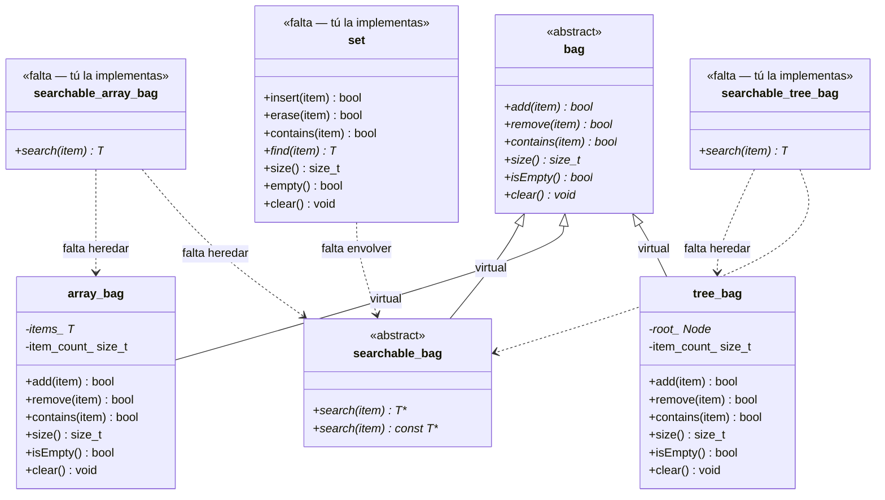
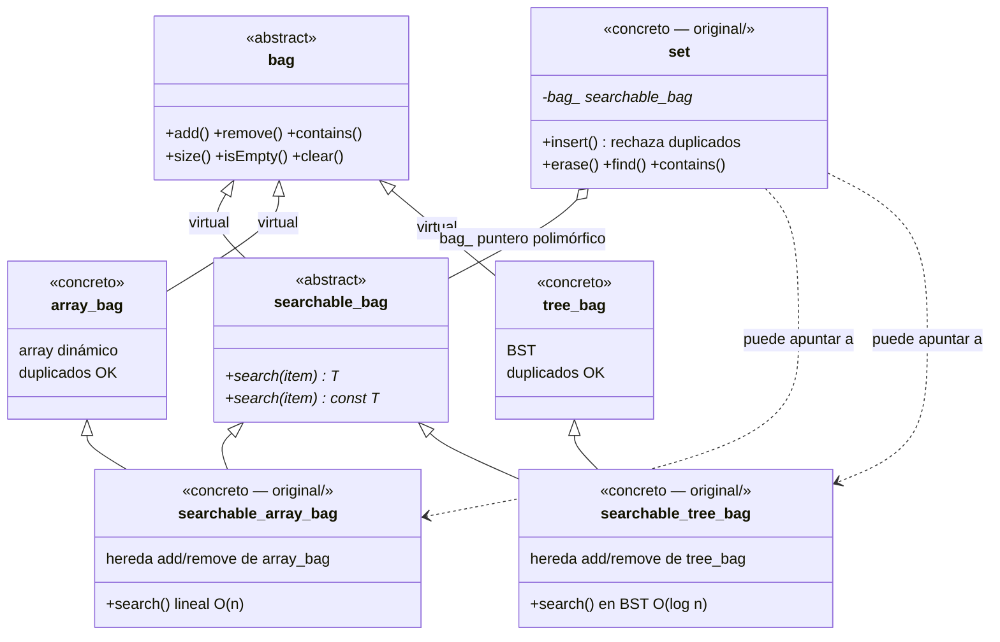
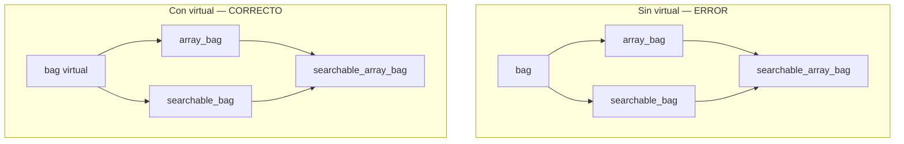
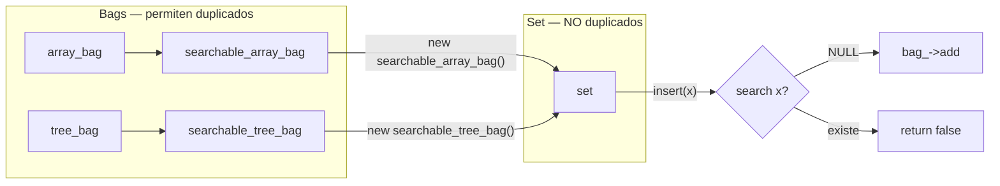

# Polyset — guía para el examen

Solución comentada en esta carpeta (`original/`). Las clases base están en `../`.

---

## Diagramas de clases (Mermaid)

### ANTES — lo que te dan al empezar el examen

En el subject ya existen las **interfaces** y dos **bags concretos**, pero faltan las clases que unen búsqueda + implementación, y el `set`.



**Lectura rápida:**

| Símbolo | Significado |
|---------|-------------|
| `<<abstract>>` | Clase con métodos `= 0` — no se instancia |
| `<<falta>>` | Lo que debes escribir tú |
| Línea sólida `--\|>` | Herencia (is-a) |
| Línea punteada `..>` | Relación pendiente / composición |

**Estado inicial:** `array_bag` y `tree_bag` funcionan solos (permiten duplicados), pero **no tienen `search()`**. `searchable_bag` define `search()` pero **no tiene implementación concreta**. No existe `set`.

---

### DESPUÉS — jerarquía completa tras tu implementación



---

### Problema del diamante (por qué `virtual`)

Sin `virtual`, `searchable_array_bag` heredaría **dos copias** de `bag`. Con `virtual`, solo hay **una**.



**En el copy constructor siempre inicializa la base virtual:**

```cpp
searchable_array_bag(const searchable_array_bag& other)
    : bag<T>(),              // ← imprescindible
      array_bag<T>(other),
      searchable_bag<T>() {}
```

---

### Flujo de uso después de implementar



**Ejemplo en código:**

```cpp
set<int> s(new searchable_array_bag<int>());
s.insert(10);  // search → NULL → add → true
s.insert(10);  // search → puntero → false (duplicado)
```

---

## Qué te dan / qué escribes tú

| Te dan | Tú implementas |
|--------|----------------|
| `bag.hpp` | — |
| `searchable_bag.hpp` | — |
| `array_bag.hpp`, `tree_bag.hpp` | — |
| — | `searchable_array_bag` |
| — | `searchable_tree_bag` |
| — | `set` |

## Orden en el examen (60–90 min)

```text
1. searchable_array_bag.hpp   (~20 min) — solo search() + OCF
2. searchable_tree_bag.hpp    (~20 min) — search() en BST + OCF
3. set.hpp                    (~15 min) — wrapper + insert
4. .cpp vacíos con #include   (~5 min)
5. Compilar con el main       (~10 min)
```

## Paso 1: searchable_array_bag

```cpp
class searchable_array_bag
    : public array_bag<T>, public searchable_bag<T>
{
    // OCF: inicializar bag<T>() en copia (herencia virtual)
    // search: bucle lineal con getItems() y size()
    // retornar &items[i] o NULL
};
```

## Paso 2: searchable_tree_bag

```cpp
class searchable_tree_bag
    : public tree_bag<T>, public searchable_bag<T>
{
    // find_node recursivo (igual que contains del tree_bag)
    // retornar &node->data o NULL
};
```

## Paso 3: set

```cpp
class set {
    searchable_bag<T>* bag_;
public:
    explicit set(searchable_bag<T>* bag);
    ~set() { delete bag_; }

    bool insert(const T& item) {
        if (bag_->search(item)) return false;
        return bag_->add(item);
    }
    // erase → remove, find → search, empty → isEmpty
};
```

## Bag vs Set

| | bag | set |
|---|-----|-----|
| Duplicados | Sí | No |
| Añadir | `add()` | `insert()` retorna false si existe |

## Errores típicos

- Olvidar `public virtual bag<T>` en las bases (diamante)
- No inicializar `bag<T>()` en el copy ctor de las searchable
- `search` devuelve copia en vez de puntero
- Olvidar versión const y no-const de `search`
- Hacer `delete` del bag fuera del set (el set es dueño)

## Compilar desde esta carpeta

```bash
cd exam_rank05/level-01/polyset/original
c++ -Wall -Wextra -std=c++98 ../main.cpp \
    searchable_array_bag.cpp searchable_tree_bg.cpp set.cpp -o polyset
./polyset
```
